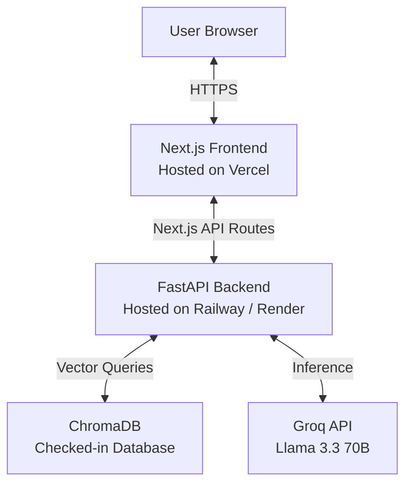

# Deployment Guide: Shahid Nalwar AI Persona

This guide walks you through deploying the **Next.js frontend** and the **FastAPI backend** so that it is live, reliable, and accessible for the requested 7-day period (and beyond).

---

## Architecture Overview



To run this application online, we deploy:
1. **Frontend**: Next.js to **Vercel** (Free, instant, permanent).
2. **Backend**: FastAPI + PyTorch to **Railway** (Recommended: no cold starts) or **Render** (Free: sleeps after 15 mins of inactivity unless pinged).

---

## Phase 1: Push Project to GitHub

Before deploying to Vercel/Railway/Render, your code needs to be hosted on GitHub. Run the following commands in your project terminal:

1. **Verify Git status and add files**:
   ```bash
   git status
   git add .
   git commit -m "Configure Dockerfile model cache and prepare for deployment"
   ```
2. **Rename default branch to `main`**:
   ```bash
   git branch -M main
   ```
3. **Create a new repository on GitHub**:
   - Go to [github.com/new](https://github.com/new).
   - Create a **Private** or **Public** repository named `shahid-ai-persona`.
4. **Push the repository**:
   ```bash
   # Replace with your actual GitHub username and repository name
   git remote add origin https://github.com/YOUR_GITHUB_USERNAME/shahid-ai-persona.git
   git push -u origin main
   ```

---

## Phase 2: Deploy the FastAPI Backend

You have two excellent choices for deploying the backend. We recommend **Railway** for zero cold starts.

### Option A: Railway (Recommended — No Cold Starts)
Railway offers a free trial tier ($5/month or 500 hours) which will easily keep your application live for the 7 days without sleeping.

1. **Sign up**: Go to [Railway](https://railway.app) and sign in using your GitHub account.
2. **Create Project**: Click **New Project** -> **Deploy from GitHub repo**.
3. **Select Repo**: Choose your `shahid-ai-persona` repository.
4. **Configure Root Directory**:
   - Go to **Settings** of the new service.
   - Set **Root Directory** to `/backend`.
   - Railway will automatically detect the `DockerFile` inside `/backend` and compile it.
5. **Set Environment Variables**:
   - Under the **Variables** tab, add:
     - `GROQ_API_KEY`: `gsk_...` (Use the Groq API key from your local `.env.local` file).
6. **Generate Domain**:
   - Under the **Settings** tab, scroll to **Networking** and click **Generate Domain**.
   - Copy this URL (e.g. `https://backend-production.up.railway.app`).

---

### Option B: Render (100% Free — Has 15-min Sleep Inactivity)
Render is completely free but spins down instances after 15 minutes of inactivity. The first request after a sleep takes ~50 seconds (cold start).

1. **Sign up**: Go to [Render](https://render.com) and log in with GitHub.
2. **Create Web Service**: Click **New +** -> **Web Service**.
3. **Connect Repository**: Select `shahid-ai-persona`.
4. **Configure Build Settings**:
   - **Name**: `shahid-backend`
   - **Root Directory**: `backend` *(Crucial: do not leave empty)*
   - **Runtime**: `Docker`
   - **Instance Type**: `Free`
5. **Set Environment Variables**:
   - Under **Advanced**, add:
     - `GROQ_API_KEY`: `gsk_...` (Your Groq API key).
6. **Deploy**: Click **Create Web Service**.
7. **Mitigate Cold Starts (Keep Alive)**:
   - Once deployed, copy your Render URL (e.g. `https://shahid-backend.onrender.com`).
   - Go to [UptimeRobot](https://uptimerobot.com) (free account).
   - Create an **HTTP(s) Monitor** pointing to your health check endpoint: `https://your-app.onrender.com/health` with a **5-minute interval**.
   - This will ping your app every 5 minutes and prevent it from going to sleep.

---

## Phase 3: Deploy the Next.js Frontend

Deploying to Vercel is free, optimized, and takes less than a minute.

1. **Sign up**: Go to [Vercel](https://vercel.com) and sign in with GitHub.
2. **Import Repo**: Click **Add New** -> **Project**, then click **Import** next to your `shahid-ai-persona` repository.
3. **Configure Project**:
   - **Framework Preset**: `Next.js`
   - **Root Directory**: Leave as root (`./`)
4. **Set Environment Variables**:
   - Expand the **Environment Variables** section and add:
     - `RAG_API_URL`: `<YOUR_BACKEND_URL>` (e.g., `https://backend-production.up.railway.app` or `https://shahid-backend.onrender.com`. **Do not add a trailing slash**).
5. **Deploy**: Click **Deploy**.
6. **Access App**: Vercel will build the frontend and provide you with a production URL (e.g., `https://shahid-ai-persona.vercel.app`).

---

## Phase 4: Connect ElevenLabs Calling Agent to RAG Backend

Since we added a standard OpenAI-compatible `/v1/chat/completions` endpoint to the backend, you can plug this RAG directly into your ElevenLabs Conversational AI voice agent.

1. **Log in to ElevenLabs**:
   - Go to [ElevenLabs](https://elevenlabs.io) and open your **Conversational AI** dashboard.
   - Select your existing voice agent that is linked to your Twilio phone number.

2. **Select Custom LLM**:
   - Go to your agent's settings and look for the **LLM** configuration section.
   - In the LLM dropdown, select **Custom LLM**.

3. **Configure Endpoint**:
   - **Base URL**: Enter your deployed FastAPI backend URL with the `/v1` prefix:
     `https://<your-backend-domain>/v1`
     *(For example: `https://your-app.onrender.com/v1` or `https://backend-production.up.railway.app/v1`)*
   - **Model ID**: Enter `llama-3.3-70b-versatile` (or any label, as our backend forces Llama 3.3).
   - **API Key**: If required by ElevenLabs, enter any dummy string (e.g., `dummy_key`), since our backend uses the `GROQ_API_KEY` stored securely in the server's environment variables.

4. **Test the Twilio Call**:
   - Save your changes.
   - Dial your Twilio number and ask a question about Shahid's experience, e.g.:
     - *"What projects did you work on?"*
     - *"Tell me about the Malaria Detection project."*
   - The ElevenLabs agent will now fetch context from ChromaDB, query Groq, and respond to your call in the first person!

---

## Verification Checklist

To verify everything is running properly:
- Open `https://<your-frontend>.vercel.app` in your browser.
- Try asking a suggestion or writing a message (e.g., *"Why should Scaler hire Shahid?"*).
- Check the console logs in Vercel/Railway if there are any network connection issues.
- You can inspect the health of the backend by visiting: `https://<your-backend-url>/health` (it should return `{"status": "healthy", ...}`).
